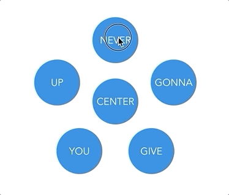
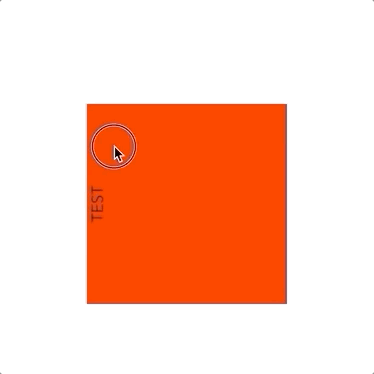
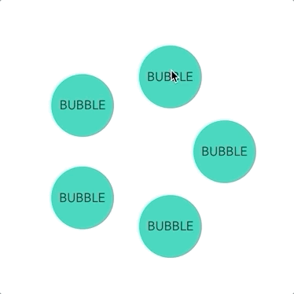

# vue-spin-wheel

VueSpinWheel is a small VueJS component library, providing small reusable components to make a wheel, draggable by user clicks and touchs.



It also **works on mobile browsers**, handling touches as mouse clicks.

## Demo

A full demo of all the components is available in the `Demo.vue` file of this repo.

You can see this component live here: [Live Demo ](https://codesandbox.io/s/vue-spin-wheel-exemple-gldnp?file=/src/Demo.vue)

## Setup

First, install the dependency using `npm` or `yarn`.
```bash
npm install --save vue-spin-wheel
# or with yarn
yarn add vue-spin-wheel
```

Then, you have to import the library css in your Vue app.

```javascript
// main.js or main.ts
import 'vue-spin-wheel/lib/vue-spin-wheel.css';
```

Finally, import the library's component just like every other components:

```javascript
import { SpinWheel, SpinItem, SpinCircle } from 'vue-spin-wheel';
```

And you'll be able to use them!

## Available components

### SpinWheel

**Allows you to rotate its sub elements by dragging them with the cursor.**



```html
<spin-wheel>
   <div class="box">TEST</div>
</spin-wheel>
```

### SpinCircle

**Display a list of elements on a circle**

The circle's size is defined by its root element size, which by default is depending on its parent element.  
So be aware that you should provide a width / heigh to the parent element of the `<spin-circle>` to define its bounds.



```html
<spin-circle :gravity="gravity" :items="items"></spin-circle>
```

The component exposes the rotation angle as a slot scope, so that you can freely access it in the parent component.

|Slot|Description|Slot scope|
|----|-----------|----------|
|default|The elements to rotate in the circle|`angle`|

#### Available properties

|Prop|Type|Description|Default|
|----|----|-----------|-------|
|items|`Array<T>`|List of custom elements to display in the circle. If `T` is not `string`, you should provide the #bubble slot (see below)|[]|
|gravity|`boolean`|Keep all elements horizontal, or let them rotate freely|false|
|item-key|`keyof T`|Optional. The name of a key of your items to be used as a unique key index|the index `i` of the item|

By default, it will display each element of `items` in a span. If the items are not strings, it will display the default `item.toString()` javascript behavior.

#### You can also provide slots to customize the circle elements.

|Slot|Description|Slot scope|
|----|-----------|----------|
|bubble|The template to display each element on the circle|`item`|
|center|The element to be displayed in the center of the circle||

```html
<spin-circle :gravity="gravity" :items="items">
    <template #bubble>
        <p>TEST</p>
    </template>

    <template #center>
        <p>CENTER</p>
    </template>
</spin-circle>
```

As these slots are common for each item and you don't have access to the inner `v-for` loop, in order to access your `item` objects, you must use a *[slot scope](https://vuejs.org/v2/guide/components-slots.html#Scoped-Slots)*.

```html
<script>
    items = [
        { label: 'item 1', enabled: true },
        { label: 'item 2', enabled: true },
        { label: 'item 3', enabled: false },
    ]
</script>

<spin-circle :items="items">
    <template v-slot:bubble="{ item }">
        <p v-if="item.enabled">{{item.label}}</p>
    </template>

    <template #center>
        <p>CENTER</p>
    </template>
</spin-circle>
```

### SpinItem

*Wrap an element by adding an optional rotation. Mostly useful inside a `SpinWheel` to counter rotate the elements inside the spinner.*

|Prop|Type|Description|Default|
|----|----|-----------|-------|
|rotation|`number`|Rotation angle in radian|0|

Simpliest usage:

```html
<script>
    angle = 90
</script>
<spin-item :rotation="angle">
    <div class="box"></div> <!-- Will be rotated by 90 radians -->
</spin-item>
```

The best use case for this component is inside a `SpinWheel` as following:

```html
<spin-wheel v-slot="{ angle }" class="flower">
    <spin-item :rotation="angle" class="bubble">
    <span>CENTER</span>
    </spin-item>
</spin-wheel>
```

By binding the wheel angle to the `SpinItem` rotation, you can counter rotate it and make it stay horizontal, even while its parent rotate!

## Contribute

If you wish to contribute, or simply debug, this library, you're free to go!

Just run:

```bash
# install dependencies
yarn
# You need to add vue, as its a peer dependency
yarn add vue
# Run the app
yarn serve
```

And go to http://localhost:8080 to see the demo app.

The rotation computation relies on the external library `ts-matrix` to compute a 360º angle between the center and the current cursor position.

### Issues

Feel free to open an issue on the github page. I'll take a look as quickly as possible!

## Roadmap:

- Automatic declaration files generation
- Add `circleDiameter` property for `SpinCircle`.
- Allow `rotation` property of `SpinItem` to be in degrees instead of radians (by auto converting)
- Try to build the lib as native web components

## They use it

Nobody yet. But I'm proud of my first vuejs lib anyway.